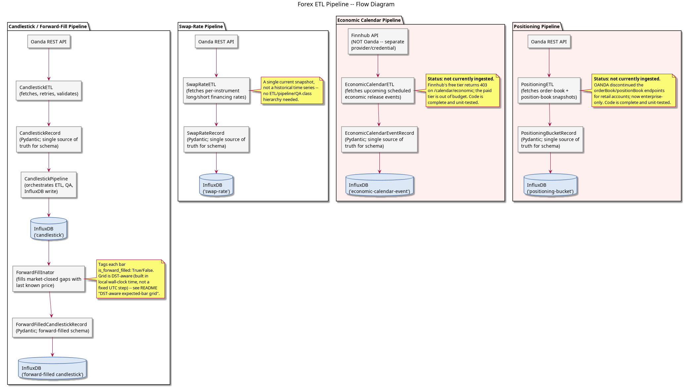

# Forex ETL Pipeline

[](https://github.com/badass-data-science/ETL-forex-time-series-data/actions/workflows/ci.yml)
[](pyproject.toml)
[](LICENSE)

Fetches OHLCV candlestick data from the [Oanda REST API](https://developer.oanda.com/rest-live-v20/introduction/) and writes it to InfluxDB. A second pipeline forward-fills gaps left by weekends, holidays, and market-closed periods, tags every bar with whether it was forward-filled, and writes the result back to InfluxDB as its own measurement.

Contributing (human or AI)? See [`AGENTS.md`](AGENTS.md) for a fast-start
orientation and the gotchas that aren't obvious from the code. There's also a
[graphify](https://github.com/safishamsi/graphify) knowledge graph of this
codebase in `graphify-out/`: open `graph.html` in a browser to explore it
interactively, or read `GRAPH_REPORT.md` for the audit report (god nodes,
cross-community bridges, suggested questions).

## Architecture

### Pipeline flow diagrams



_PlantUML source: [`documentation/pipeline_flow_diagram.puml`](documentation/pipeline_flow_diagram.puml)._

Downstream consumers (e.g. `forex-ML`) can use `is_forward_filled` to distinguish
real market data from imputed placeholder bars — a forward-filled bar has zero
return and zero volatility by construction, which is otherwise indistinguishable
from a genuinely quiet real market.

**DST-aware expected-bar grid (fixed 2026-07-14):** `ForwardFillInator` decides
which timestamps a candle is expected to exist at by building a grid, then
merging real data onto it — anything unmatched gets forward-filled. That grid
used to be a fixed number of UTC seconds between bars, forever
(`np.arange(mn, mx + step, step)`). H1/M15 candles are anchored to fixed
UTC-hour/quarter-hour marks, so this was fine for them. H4/D candles are
anchored to a local time-of-day instead (the same 5pm America/New_York-style
rollover convention used elsewhere in this pipeline), which shifts by exactly
one hour, in UTC terms, at every DST transition — so the old grid silently fell
out of alignment with real data twice a year, and every bar after that point
got forward-filled from the last real match instead of matched to its own real
value. Confirmed directly against real EUR/USD history before fixing anything:
H1/M15 had zero misaligned rows across their full history; H4/D had ~66%
misaligned, with the very first bad H4 row landing on 2010-03-14 — the exact
date the US switched to Daylight Time that year. The grid is now built in
local wall-clock time and localized per-instant, so it tracks the real DST
shift instead of assuming one fixed UTC offset holds forever (verified: zero
misaligned rows across all 17 years of real H4 history, spanning every spring
and fall transition in that range). Already-ingested forward-filled H4/D
history in InfluxDB needs a re-run of `forward_fill_flow` (or the batch
equivalent) to pick up the correction — `ForwardFillInator.pull_data()` always
re-pulls the full history from `cutoff_timestamp` and re-writes every row,
so one full run recomputes everything; there's no separate backfill script
needed.

`swap-rate` is a separate, much simpler pipeline: a single current snapshot of
long/short financing (rollover) rates per instrument, not a historical time series
like candlesticks, so there's no ETL/pipeline/QA class hierarchy for it — just
`SwapRateETL` directly. Downstream, `forex-ML`'s `forex_ml/data/swap_rates.py`
reads this measurement directly (converting OANDA's annual-rate-as-decimal
convention to a per-night percentage) to account for the real cost of holding a
position past the 5pm New York rollover cutoff — both in triple-barrier labeling
and, via that same module, in `forex-strategy`'s backtest.

`economic-calendar-event` is the one pipeline here NOT sourced from Oanda — economic
calendar data (scheduled release times, country, impact level, actual/estimate/
previous values) isn't part of Oanda's API at all, so it comes from
[Finnhub](https://finnhub.io/), with its own separate API-key credential (see
"Prerequisites" below). Like swap rates, it's a forward-looking pull over a date
range rather than an incremental backfill — re-pulling the same rolling window daily
is cheap and naturally idempotent, and picks up newly-published `actual` values for
events that already occurred.

**Status: not currently ingested.** `/calendar/economic` returns `403` on
Finnhub's free tier (confirmed with a valid, working API key — the free plan
simply doesn't include this endpoint); the paid tier that does is priced well
outside this project's budget. The code is complete and unit-tested, ready to run
the moment either a cheaper provider is found or the budget changes — abandoned
for now on cost, not because anything here is broken.

`positioning-bucket` is back to Oanda's own API/token (the `/v3/instruments/
{instrument}/orderBook` and `/positionBook` endpoints, reachable with no new auth
work) — aggregated retail order-book/position-book data, one row per price bucket
per snapshot rather than a single collapsed "overall % long/short" stat: Oanda's
per-bucket percentage normalization isn't something to silently reinterpret here,
so a downstream consumer computes whatever aggregate it actually needs directly
from the raw buckets. A real snapshot can carry a hundred-plus buckets per
instrument per book type, a real storage/cardinality cost worth being aware of
unlike every other measurement in this pipeline.

**Status: not currently ingested.** Confirmed directly against both a practice
and a live production account/token (the live token independently verified valid
against other endpoints) that these endpoints reject every request. OANDA
discontinued orderBook/positionBook entirely as a business decision; the data is
now only offered through a separate enterprise product priced at $1,850/month
with a $22,000/year minimum. Abandoned for now on cost, same as the economic
calendar above — the code is otherwise complete, but there's no plan-upgrade path
here, only a fundamentally different (and expensive) product.

Every pipeline is wrapped as a **Prefect flow** (`src/forex/flows/`) for scheduling and observability.

## Project layout

```
src/forex/
├── critical_timezone.py          # market-hours gate (Toronto tz)
├── etl/
│   ├── CandlestickETL.py         # API fetch + transform
│   ├── SwapRateETL.py            # per-instrument financing (swap/rollover) rate fetch
│   ├── EconomicCalendarETL.py    # scheduled economic release event fetch (Finnhub)
│   ├── PositioningETL.py         # order-book/position-book snapshot fetch
│   ├── models.py                 # CandlestickRecord/SwapRateRecord/
│   │                              # EconomicCalendarEventRecord/
│   │                              # PositioningBucketRecord (Pydantic)
│   ├── config/
│   │   ├── database_config.py    # InfluxDB credentials (via environment variables)
│   │   └── finnhub_config.py     # Finnhub API key (via environment variables)
│   └── pipelines/
│       ├── CandlestickPipeline.py
│       └── ForwardFillInator.py
├── flows/
│   ├── _common.py                # make_ifc() -- shared by every flow below
│   ├── candlestick_flow.py       # Prefect: fetch → InfluxDB (single pair + batch)
│   ├── forward_fill_flow.py      # Prefect: forward-fill gaps
│   ├── swap_rate_flow.py         # Prefect: fetch swap rates → InfluxDB
│   ├── economic_calendar_flow.py # Prefect: fetch calendar events → InfluxDB
│   ├── positioning_flow.py       # Prefect: fetch order/position book → InfluxDB
│   └── serve.py                  # scheduled deployments for all tracked instruments
├── oanda/
│   ├── headers.py                # builds Oanda auth headers
│   └── config/
│       ├── oanda_config.py       # Oanda credentials (via environment variables)
│       └── price_type_map.py     # bid/ask/mid label mapping
└── util/                         # vendored-in-house: no external private-repo dependency
    ├── influxdb_tool.py          # InfluxDbTool (InfluxDB read/write)
    └── time_conversions.py       # seconds_in_one_{hour,day,week}

tests/
├── test_critical_timezone.py
├── test_models.py
├── test_candlestick_etl.py
├── test_forward_fill_inator.py
├── test_swap_rate_etl.py
├── test_economic_calendar_etl.py
├── test_positioning_etl.py
├── test_influxdb_tool.py
└── test_secrets_isolation.py

graphify-out/          # knowledge graph of this codebase (tracked subset)
├── graph.json          # raw graph data
├── graph.html           # interactive viz, open in any browser
└── GRAPH_REPORT.md      # audit report: god nodes, bridges, suggested questions

documentation/
├── pipeline_flow_diagram.puml   # PlantUML source for the Architecture diagram
└── images/
    └── pipeline_flow_diagram.png
```

This package has no dependency on any private/internal repo — everything it
needs is either a PyPI package (see `pyproject.toml`) or lives in `forex.util`
above. `pip install -e ".[dev]"` and `python -m build` both work standalone.

## Prerequisites

```
pip install -e ".[dev]"          # installs prefect, pydantic, tenacity, etc.
```

You also need:
- **Environment variables** for Oanda credentials: `OANDA_SERVER`, `OANDA_TOKEN`,
  and `OANDA_DATE_TIME_FORMAT` (`CandlestickETL`/`SwapRateETL`/`PositioningETL` all
  read these). Optionally `OANDA_ACCOUNT_ID` — `SwapRateETL` uses it if set,
  resolving it via `/v3/accounts` otherwise (see "Swap/rollover rates" below).
- **Environment variables** for InfluxDB credentials and the Finnhub API key:
  `INFLUXDB_URL`, `INFLUXDB_TOKEN`, `INFLUXDB_ORG`, `INFLUXDB_BUCKET`, and
  `FINNHUB_API_KEY`.
- A **Finnhub API key**, set as `FINNHUB_API_KEY` — only needed if running
  `economic_calendar_flow` manually; note the free tier does **not** include
  the `/calendar/economic` endpoint (confirmed — returns `403`), so a working
  key alone isn't enough. See "Architecture" above.
- A running **InfluxDB** instance

`database_config`/`finnhub_config`/`oanda_config` all lazy-load these environment
variables via a module-level `__getattr__` triggered on attribute access. Every
module that needs them accesses it as `database_config.INFLUXDB_URL` (resolved
fresh each call) rather than `from database_config import INFLUXDB_URL` — the
latter freezes the resolved value into the importing module's own namespace the
moment it's imported (including just pytest collecting a test file), permanently,
for the life of the process, with no way to substitute different values
afterward. See `tests/test_secrets_isolation.py` for the regression test and the
real bug this guards against — a downstream consumer's "flaky" integration test
turned out to be silently querying this real InfluxDB instead of its intended
local Docker container, because of exactly this.

## Running

There are two entry points: a one-off run for a single instrument, and a scheduled deployment that covers all 14 tracked instruments across four granularities.

### Option 1 — One-off run (no Prefect server needed)

Single candlestick pair:

```python
from forex.flows.candlestick_flow import candlestick_flow
candlestick_flow(instrument='EUR_USD', granularity='H1')
```

All tracked instruments for one granularity:

```python
from forex.flows.candlestick_flow import candlestick_batch_flow
candlestick_batch_flow(granularity='H1')
```

Forward-fill gaps for one pair (fills gaps, tags each bar `is_forward_filled`, and
writes the result to InfluxDB's `forward-filled candlestick` measurement):

```python
from forex.flows.forward_fill_flow import forward_fill_flow
forward_fill_flow(instrument='EUR/USD', granularity='H1')
```

Swap/rollover rates for all tracked instruments (a single current snapshot, not a
historical backfill):

```python
from forex.flows.swap_rate_flow import swap_rate_flow
swap_rate_flow()
```

Economic calendar events for a rolling 14-day-ahead window (no Oanda credentials
needed — this pulls from Finnhub, not Oanda). **Currently blocked** — see
"Architecture" above; this will raise `403` on a free-tier Finnhub key:

```python
from forex.flows.economic_calendar_flow import economic_calendar_flow
economic_calendar_flow(days_ahead=14)
```

Order-book/position-book snapshots for all tracked instruments (back to Oanda's own
API/token, same as candlesticks). **Currently blocked** — see "Architecture"
above; OANDA discontinued this endpoint entirely, so this will raise `400`/`401`
regardless of account:

```python
from forex.flows.positioning_flow import positioning_flow
positioning_flow()
```

### Option 2 — Scheduled deployment (all tracked instruments, four granularities)

Start a local Prefect server once (in its own terminal or as a service):

```
prefect server start
```

Then start the serve process, which registers and runs all nine deployments
(requires `OANDA_SERVER`/`OANDA_TOKEN`/`OANDA_DATE_TIME_FORMAT` and the InfluxDB
env vars from "Prerequisites" above to already be set in the environment):

```
python -m forex.flows.serve
```

This registers nine deployments visible at http://localhost:4200 — one candlestick-fetch
deployment per granularity, each paired with a forward-fill deployment offset 10 minutes
later so it always runs against freshly-landed candles rather than racing the fetch that
feeds it:

| Deployment | Cron | Granularity | Instruments |
|---|---|---|---|
| `candlestick-D` | `5 0 * * *` | D | all 14 tracked |
| `candlestick-H1` | `5 * * * *` | H1 | all 14 tracked |
| `candlestick-H4` | `20 * * * *` | H4 | all 14 tracked |
| `candlestick-M15` | `2,17,32,47 * * * *` | M15 | all 14 tracked |
| `forward-fill-D` | `15 0 * * *` | D | all 14 tracked |
| `forward-fill-H1` | `15 * * * *` | H1 | all 14 tracked |
| `forward-fill-H4` | `30 * * * *` | H4 | all 14 tracked |
| `forward-fill-M15` | `12,27,42,57 * * * *` | M15 | all 14 tracked |
| `swap-rate-D` | `45 20 * * *` | n/a | all 14 tracked |

`candlestick-H4`/`forward-fill-H4` poll every hour rather than every 4 hours at a
guessed boundary offset -- OANDA's exact H4 candle-close alignment (UTC vs.
NY-timezone-anchored, and whether/how it shifts with DST) isn't confirmed, and
`CandlestickETL` already resumes from the last stored timestamp per granularity, so
polling more often than a new candle actually closes just finds nothing new rather
than risking a wrong guess silently missing candles for hours.

The 14 tracked instruments are: EUR/USD, USD/JPY, GBP/USD, USD/CHF, USD/CAD, AUD/USD,
NZD/USD (the seven FX majors), XAU/USD (gold, added 2026-07-14 to test whether a
different asset class carries more signal than heavily-arbitraged FX majors), and
six FX crosses added the same window for the same reason: GBP/JPY, EUR/JPY, AUD/JPY,
EUR/GBP, AUD/NZD, EUR/CHF.

`swap-rate-D` runs at 20:45 UTC — about 15 minutes before the 5pm New York rollover
cutoff (a fixed UTC time, not DST-aware, the same simplification forex-ML's own
trading-session features already make) — so a fresh rate is on hand right as any
position held past the cutoff would actually be charged one.

`economic_calendar_flow` and `positioning_flow` are intentionally NOT in this table
— both are blocked on external cost/access issues, not bugs (see "Architecture"
above), so scheduling either would just accumulate failed runs. `serve.py` no
longer registers deployments for them; if you deployed this service before
2026-07-10, restart `python -m forex.flows.serve` to drop them.

The forward-fill deployments were missing entirely until 2026-07-06 — `serve.py` only
ever registered the three candlestick deployments, so forward-filled data never got
produced on an ongoing basis; it only ran when triggered manually (a direct function
call, or the one-off `scripts/recompute_forward_fill_history.py`). If you deployed this
service before that date, restart `python -m forex.flows.serve` to pick up the three new
deployments.

The market-hours gate (`check_market_open_task`) no-ops any run outside forex trading hours (Fri 17:00 ET → Sun 17:00 ET), so no extra cron filtering is needed.

To trigger a deployment run manually from the CLI:

```
prefect deployment run 'forex-candlestick-batch/candlestick-H1' \
  --param granularity=H1
```

To run a single pair ad-hoc against a live Prefect server:

```
prefect deployment run 'forex-candlestick-etl/forex-candlestick-etl' \
  --param instrument=EUR_USD \
  --param granularity=H1
```

### Scheduling (custom pairs or granularities)

To customise which instruments or add a new granularity, pass `instruments` when triggering a batch run:

```python
from forex.flows.candlestick_flow import candlestick_batch_flow
candlestick_batch_flow(
    granularity='M5',
    instruments=['EUR_USD', 'GBP_USD'],
)
```

Or modify `TRACKED_INSTRUMENTS` in `src/forex/flows/candlestick_flow.py` and restart `serve.py`.

## Data model

All five records below subclass `MeasurementRecord` (`src/forex/etl/models.py`),
which implements `to_influx_dict()` once from each subclass's `TAGS`/`MEASUREMENT`/
`FIELDS` — no per-model reimplementation of the tag/field/time split.

`CandlestickRecord` (`src/forex/etl/models.py`) is the single source of truth for the candlestick schema:

| Attribute | Purpose |
|---|---|
| `MEASUREMENT` | InfluxDB measurement name (`'candlestick'`) |
| `TAGS` | InfluxDB tag set (`instrument`, `granularity`) |
| `FIELDS` | InfluxDB field set with types (bid/ask OHLCV) |
| `.to_influx_dict()` | Serialises a record to the InfluxDB write payload |

Pydantic enforces types on ingestion; `to_influx_dict()` produces the InfluxDB write payload.

`ForwardFilledCandlestickRecord` (`src/forex/etl/models.py`) is the schema for the forward-filled output:

| Attribute | Purpose |
|---|---|
| `MEASUREMENT` | InfluxDB measurement name (`'forward-filled candlestick'`) |
| `TAGS` | InfluxDB tag set (`instrument`, `granularity`) |
| `FIELDS` | `mid_open/high/low/close`, `spread_close`, `volume`, `is_forward_filled` |
| `.to_influx_dict()` | Serialises a record to the InfluxDB write payload |

`is_forward_filled` is set once, right after `ForwardFillInator` merges the pulled
candles onto the full market-open time grid — `True` for a timestamp with no real
candle at that point, `False` otherwise. It survives the subsequent forward-fill
step untouched (`ffill()` only fills genuine `NaN`s in the OHLCV columns; this field
is never null to begin with).

`SwapRateRecord` (`src/forex/etl/models.py`) is the schema for per-instrument financing rates:

| Attribute | Purpose |
|---|---|
| `MEASUREMENT` | InfluxDB measurement name (`'swap-rate'`) |
| `TAGS` | InfluxDB tag set (`instrument` only — no `granularity`, see below) |
| `FIELDS` | `long_rate`, `short_rate` |
| `.to_influx_dict()` | Serialises a record to the InfluxDB write payload |

Unlike the candlestick records, there's no `granularity` tag — a financing rate is
an account-level daily snapshot per instrument, not tied to any candle timeframe.
`long_rate`/`short_rate` are OANDA's daily financing rates (as a fraction, e.g.
`-0.0067` for the long side), charged (or credited, if positive) once per day a
position is held past the 5pm New York rollover cutoff.

`EconomicCalendarEventRecord` (`src/forex/etl/models.py`) is the schema for scheduled
economic release events (Finnhub, not Oanda):

| Attribute | Purpose |
|---|---|
| `MEASUREMENT` | InfluxDB measurement name (`'economic-calendar-event'`) |
| `TAGS` | `country`, `impact`, `event` |
| `FIELDS` | `actual`, `estimate`, `prev` (all optional), `unit` |
| `.to_influx_dict()` | Serialises a record to the InfluxDB write payload |

`event` (e.g. "Non-Farm Payrolls") is a tag despite having more distinct values than
any other tag in this pipeline — it's a bounded, recurring set of named releases
(not free text), and being able to filter/group by event name is the whole point of
ingesting this data. `actual`/`estimate`/`prev` are all optional: a future-scheduled
event has no `actual` yet (and possibly no `estimate` either), so `to_influx_dict()`
omits any `None` field entirely rather than writing it as null — the one place this
schema's serialization differs from the other three records above.

`PositioningBucketRecord` (`src/forex/etl/models.py`) is the schema for one price bucket of
an order-book or position-book snapshot:

| Attribute | Purpose |
|---|---|
| `MEASUREMENT` | InfluxDB measurement name (`'positioning-bucket'`) |
| `TAGS` | `instrument`, `book_type` (`'order'` or `'position'`) |
| `FIELDS` | `bucket_price`, `long_count_percent`, `short_count_percent` |
| `.to_influx_dict()` | Serialises a record to the InfluxDB write payload |

One row per price bucket, not a single collapsed "overall % long/short" stat —
Oanda's per-bucket percentage normalization isn't something to silently reinterpret
here, so a downstream consumer computes whatever aggregate it actually needs
(near-price concentration, distance-weighted, etc.) directly from the raw buckets.
A real snapshot can carry a hundred-plus buckets per instrument per book type — a
genuine storage/cardinality cost worth being aware of, unlike every other
measurement in this pipeline.

## Tests

```
pytest        # test_critical_timezone.py + test_models.py + test_candlestick_etl.py
              # + test_forward_fill_inator.py + test_swap_rate_etl.py
              # + test_economic_calendar_etl.py + test_positioning_etl.py
              # + test_influxdb_tool.py + test_secrets_isolation.py
pytest -v     # verbose output (configured in pyproject.toml)
```

No external dependencies — no Oanda, no InfluxDB, no AWS required to run the test suite.

Linting (`ruff check`), formatting (`ruff format --check`), and type checking
(`mypy`) are configured in `pyproject.toml` and run in CI as a separate job
(`.github/workflows/ci.yml`):

```
ruff check src tests
ruff format --check src tests
mypy src/forex
```

Coverage is measured with `pytest-cov` and gated at 65% in CI (current: ~70%
— see `AGENTS.md` for why flow/orchestration glue code is intentionally not
chased to 100%):

```
pytest tests --cov=forex --cov-report=term-missing
```

`test_forward_fill_inator.py` covers the `is_forward_filled` flag, the actual
forward-fill propagation, and the InfluxDB record schema. It's also the regression
test for a real bug: `account_for_holiday_market_closure()` used to run *before*
`forward_fill_it()` and call a bare `dropna()` (no `subset=`) on the pre-ffill frame,
which drops every row with *any* missing OHLCV value — i.e. every gap, not just
holiday closures. That made `forward_fill_it()`'s `ffill()` a no-op: nothing was
left with a `NaN` by the time it ran. Fixed by reordering so `forward_fill_it()`
runs first, and narrowing `account_for_holiday_market_closure()` to drop only rows
still `NaN` after forward-filling (leading rows before any real candle exists to
fill from). A `TODO` remains in that method to replace it with an explicit holiday
calendar, so extended multi-day closures (e.g. Christmas week) get dropped/flagged
instead of bridged over with a stale price.
