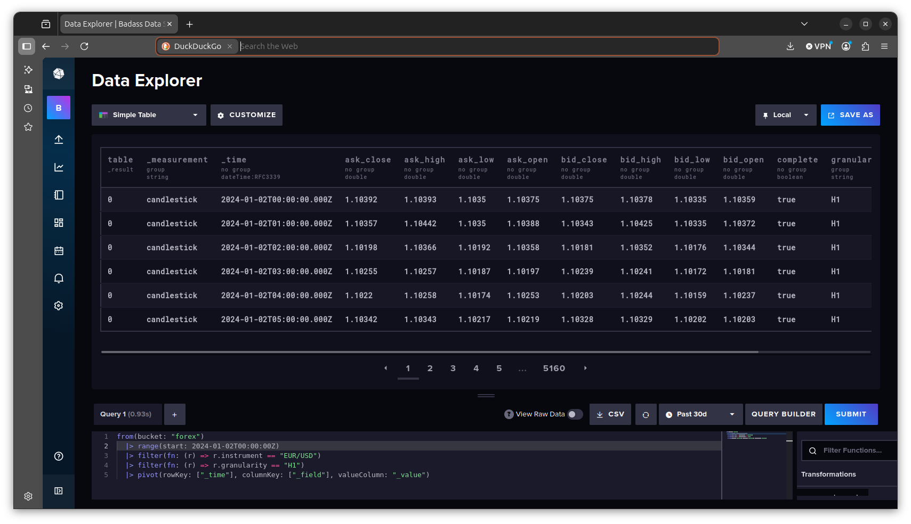
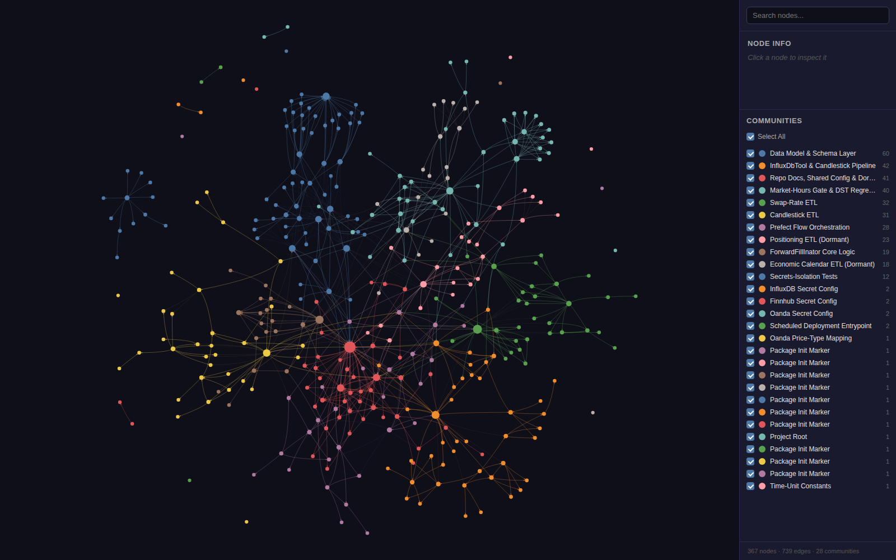
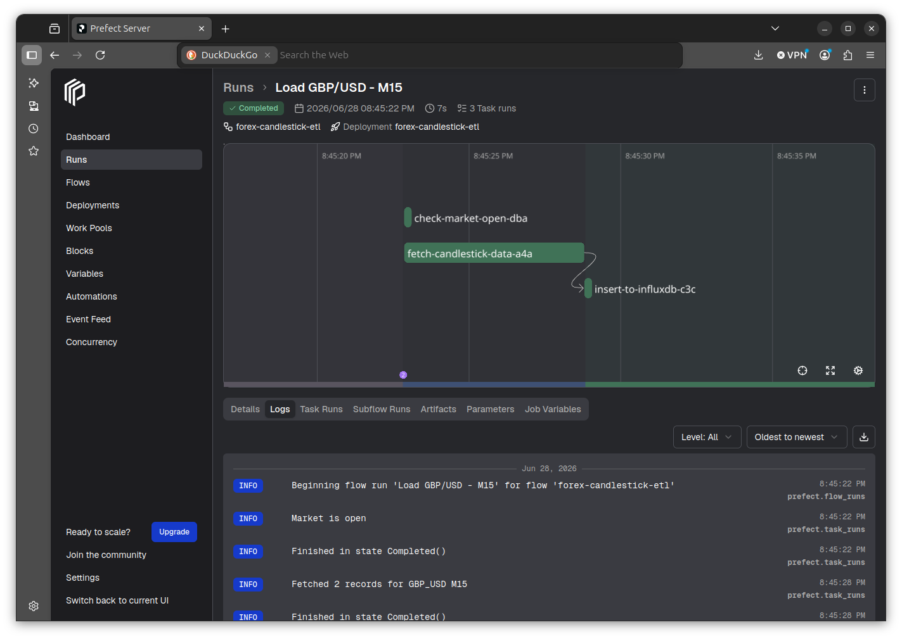

# A Time-Series Database for Forex Data Engineering

***SUBTITLE:***  Our heroine builds a production-grade OHLCV pipeline using InfluxDB and Prefect

Our heroine—a mild-mannered data scientist by day—ruthlessly shorts flailing assets by night. She wants to build AI/ML-based systematic trading strategies, but such trading strategies require data. Reliable, clean, continuously updated data. And so, before she can do anything interesting with Forex prices using ML, she has to solve a more fundamental problem: how does one store and maintain over a decade's worth of candlestick data in a way that makes it fast to query, easy to update, and is honest about what that data storage contains?

So our intrepid heroine built a robust ETL pipeline to perform that exact task. In the future she will use the database this pipeline maintains to generate AI/ML-based forecasting strategies. But this current post is about the pipeline and database themselves:

## Why Candlesticks

Our heroine sources her data from Oanda, a retail Forex broker that exposes a REST API for historical and streaming price data. Oanda provides candlestick (OHLCV) data: for each time interval, the open, high, low, and close prices for both the bid and ask sides of the market, plus volume.

A candlestick for EUR/USD at hourly granularity looks roughly like this in Oanda's API response:

```json
{
  "time": "1700000000",
  "complete": true,
  "volume": 1842,
  "bid": { "o": "1.09001", "h": "1.09187", "l": "1.08994", "c": "1.09142" },
  "ask": { "o": "1.09015", "h": "1.09201", "l": "1.09008", "c": "1.09156" }
}
```

The `complete` flag matters: an incomplete candlestick means the interval hasn't closed yet. Including incomplete candles in a training dataset would introduce look-ahead bias. The pipeline filters them out.

## The Database Decision: Why InfluxDB

The data is time series. Native time series. And our heroine really digs working with time series information. Therefore she wanted a database system equally time series-native.

She considered using a relational database first. PostgreSQL can store time-series data; it will accept a row per candle, and one can index on timestamp. It works.

But the relational approach fights the basic data model.

Forex OHLCV data has a specific shape: it is append-only (you never update a closed candle), it is almost always queried by time range, and it has a fixed set of metadata that naturally groups rows—`instrument` (e.g., currency pairs like EUR/USD and GBP/JPY) and `time granularity` (M15, H1, D). In relational terms these function as filter columns, not join columns. Every interesting query starts with something akin to "give me all EUR/USD one-hour candles between timestamps X and Y."

InfluxDB is designed for exactly this operation. It organizes data into **measurements** (think: table), **tags** (indexed metadata—`instrument` and `granularity` here), and **fields** (the actual values—bid/ask OHLC prices plus volume). InfluxDB's query language, Flux, expresses time-range scans and tag filters in readable lines:

```flux
from(bucket: "forex")
  |> range(start: 2024-01-02T00:00:00Z)
  |> filter(fn: (r) => r.instrument == "EUR/USD")
  |> filter(fn: (r) => r.granularity == "H1")
  |> pivot(rowKey: ["_time"], columnKey: ["_field"], valueColumn: "_value")
```

Running this query produces the following example output:



The same query in SQL would require a WHERE clause, a timestamp index hint, and if you want the bid and ask fields as columns rather than rows, a pivot or a set of self-joins. InfluxDB makes the common case simple.

There is also a practical consideration: InfluxDB has built-in retention policies, downsampling tasks, and a time-series aware data model that handles the `max(timestamp)` query—e.g., "what is the most recent candlestick already stored for this instrument?"—extremely efficiently. Our heroine uses this query during every pipeline run to determine where to resume ingestion. In a relational database this procedure would require a table scan or a carefully maintained index. In InfluxDB it is a first-class operation.

## Pipeline Architecture

The pipeline has three moving parts: the Oanda API client to pull updated Forex price data from the broker, a validation layer to ensure only quality content gets inserted into the database, and finally the InfluxDB insert itself. ***Prefect*** coordinates them. Here is the shape of it:

```
Oanda REST API
      ↓
CandlestickETL.fit()
      ↓  (raw dict → structured record)
CandlestickRecord  [Pydantic validation]
      ↓  (to_influx_dict())
InfluxDbTool.insert_dictionary_list()
      ↓
InfluxDB
```

Each layer has a single responsibility. The ETL class fetches and normalises raw API responses. Then the Pydantic model validates the shape of each record and produces the dict structure that InfluxDB expects. Finally the InfluxDB tool handles the write. Nothing crosses those boundaries.

## Fetching Data: CandlestickETL

The Oanda API returns up to 5,000 candles per request. Our heroine's `CandlestickETL` class walks backward through time in 5,000-candle windows until it reaches the most recent timestamp already stored in InfluxDB, then writes only the new records. On first run it fetches from 2010 (near the beginning of available Oanda data). On subsequent runs it resumes from where it left off.

A `tenacity` retry decorator handles transient network failures cleanly:

```python
@retry(
    stop=stop_after_attempt(5),
    wait=wait_fixed(2),
    retry=retry_if_exception_type(requests.RequestException),
    reraise=True,
)
def _fetch_from_api(self, url: str) -> dict:
    r = requests.get(url, headers=self.headers)
    r.raise_for_status()
    return r.json()
```

Five attempts, two seconds between each, re-raise on final failure so Prefect can record the task as failed rather than hanging.

## Validation: CandlestickRecord

Before anything touches the database, each candle passes through a Pydantic model:

```python
class MeasurementRecord(BaseModel):
    """Base class for every InfluxDB-bound record. Subclasses declare
    TAGS/MEASUREMENT/FIELDS and get to_influx_dict() for free."""

    TAGS: ClassVar[frozenset[str]]
    MEASUREMENT: ClassVar[str]
    FIELDS: ClassVar[dict[str, type]]
    omit_none_fields: ClassVar[bool] = False

    def to_influx_dict(self) -> dict:
        data = self.model_dump()
        result: dict = {
            'measurement': self.MEASUREMENT,
            'tags': {},
            'fields': {},
            'time': data.pop('timestamp'),
        }
        for key, value in data.items():
            if key in self.TAGS:
                result['tags'][key] = value
            elif not (self.omit_none_fields and value is None):
                result['fields'][key] = value
        return result


class CandlestickRecord(MeasurementRecord):
    instrument: str
    granularity: str
    volume: int
    complete: bool
    bid_open: float
    bid_high: float
    bid_low: float
    bid_close: float
    ask_open: float
    ask_high: float
    ask_low: float
    ask_close: float
    timestamp: int

    TAGS: ClassVar[frozenset[str]] = frozenset({'instrument', 'granularity'})
    MEASUREMENT: ClassVar[str] = 'candlestick'
    FIELDS: ClassVar[dict[str, type]] = {'volume': int, 'complete': bool, ...}
```

`CandlestickRecord` is one of five schemas in the pipeline (the others cover swap rates, economic-calendar events, order-book/position-book snapshots, and forward-filled candles), and all five subclass this one `MeasurementRecord` base. That wasn't always true — each model used to reimplement `to_influx_dict()` by hand, identically, five times. Consolidating it into one base class was itself a small lesson in schema design: once you have more than one shape that serializes the same way, the serialization belongs on a base class, not copy-pasted into each subclass.

Either way, this is the only place in the entire pipeline where the schema is enforced. If the Oanda API ever returns a malformed response, or if a code change accidentally drops a field, the `ValidationError` is raised here—at the write boundary—rather than written silently to the database as a null. `to_influx_dict()` then produces exactly the structure `InfluxDbTool` expects: a measurement name, a tag dict, a field dict, and a timestamp.

This separation is visible in the knowledge graph of our heroine's codebase. The graph clusters the record models into a "Data Model & Schema Layer" community, distinct from the "InfluxDbTool & Candlestick Pipeline" community that holds the database client — `CandlestickRecord` has no direct edge to `InfluxDbTool` at all. The only path between them runs through `CandlestickETL`, which uses both. The record only ever produces a dict; the client lives elsewhere.


*The current knowledge graph: 367 nodes, 739 edges, 28 auto-detected communities. The data-model layer and the InfluxDB client cluster separately, exactly as the code's own separation of concerns would predict.*

## Secrets: The PEP 562 Pattern

The InfluxDB credentials live in environment variables — `INFLUXDB_URL`, `INFLUXDB_TOKEN`, `INFLUXDB_ORG`, `INFLUXDB_BUCKET`. Reading them at module import time — the naive approach — means credentials are resolved before `main()` runs, before any argument parsing, and in contexts (test runs, linting, CI) where those variables may not even be set.

Our heroine therefore uses Python's PEP 562 module `__getattr__` to make the read lazy:

```python
# database_config.py
import os

_REQUIRED = frozenset({'INFLUXDB_URL', 'INFLUXDB_TOKEN', 'INFLUXDB_ORG', 'INFLUXDB_BUCKET'})

def __getattr__(name: str) -> str:
    if name in _REQUIRED:
        try:
            return os.environ[name]
        except KeyError as e:
            raise AttributeError(f"module {__name__!r} has no attribute {name!r}") from e
    raise AttributeError(f"module {__name__!r} has no attribute {name!r}")
```

When any part of the codebase accesses `database_config.INFLUXDB_URL`, Python calls `__getattr__('INFLUXDB_URL')` at access time, not at import time — nothing is resolved just by importing the module. This means `import database_config` is always safe, even in an environment with no credentials configured at all; the environment variable is only read the moment some code actually needs the value.

There's a real gotcha buried in that `except KeyError` clause, and it's worth calling out because it's the kind of thing that only breaks by surprise. The first version of this pattern let a bare `KeyError` from `os.environ[name]` escape `__getattr__` directly. Python's data model requires `__getattr__` to raise `AttributeError` for "attribute not found" — anything else breaks `hasattr()`, `getattr(x, name, default)`, and (concretely, in this codebase) pytest's `monkeypatch.setattr(..., raising=False)`, which all catch `AttributeError` specifically to mean "not set." A `KeyError` instead of an `AttributeError` looks identical until the moment someone calls `hasattr(database_config, 'INFLUXDB_URL')` in a test and gets an uncaught exception instead of `False`. Converting the exception type at the boundary — `except KeyError as e: raise AttributeError(...) from e` — is now a regression-tested requirement (`test_missing_env_var_raises_attribute_error_not_key_error`), not just a style preference.

The knowledge graph shows this pattern honestly: `__getattr__()` reads directly from `os.environ`, a single hop, no hidden hand-off to a secrets service. That's a genuine simplification over the pipeline's earlier design, which fetched credentials from AWS Secrets Manager through an extra layer of indirection the graph could never fully see (the dispatch was too dynamic for static analysis to trace end-to-end). Environment variables are less exotic, but they're also transparent — what the graph shows is what actually happens at runtime, with no invisible edges left to explain away.

## Orchestration: Prefect

The pipeline originally ran as cron job calling a Python class directly. This worked, but provided no visibility into failures, no retry policy at the workflow level, and no run history. Our heroine improved this situation by replacing the cron job with a Prefect flow:



The complete candlestick fetch flow consists of three tasks and a flow function:

```python
@task(name='check-market-open')
def check_market_open_task() -> bool:
    logger = get_run_logger()
    open_ = is_market_open()
    logger.info('Market is %s', 'open' if open_ else 'closed')
    return open_

@task(name='fetch-candlestick-data', retries=3, retry_delay_seconds=30)
def fetch_candlestick_data(instrument: str, granularity: str) -> list[dict]:
    logger = get_run_logger()
    ifc = make_ifc()
    etl = CandlestickETL(instrument, granularity, ifc)
    etl.fit()
    logger.info('Fetched %d records for %s %s', len(etl.to_influx_list), instrument, granularity)
    return etl.to_influx_list

@task(name='insert-to-influxdb', retries=3, retry_delay_seconds=30)
def insert_to_influxdb(records: list[dict]) -> None:
    logger = get_run_logger()
    if not records:
        logger.info('No new records to insert')
        return
    ifc = make_ifc()
    ifc.insert_dictionary_list(
        records,
        CandlestickRecord.TAGS,
        CandlestickRecord.FIELDS,
        database_config.INFLUXDB_BUCKET,
    )
    logger.info('Inserted %d records', len(records))

@flow(name='forex-candlestick-etl', log_prints=True)
def candlestick_flow(instrument: str, granularity: str) -> None:
    if not check_market_open_task():
        return
    records = fetch_candlestick_data(instrument, granularity)
    insert_to_influxdb(records)
```

A few design choices prove worth noting:

**The market-hours gate.** Forex markets close Friday at 5pm Eastern (U.S.) and reopen Sunday at 5pm. The `check_market_open_task()` evaluates this and returns early if the market is closed, so the flow can be scheduled aggressively (every 15 minutes on weekdays) without making API calls during downtime.

**`make_ifc()` is called inside tasks, not passed as a parameter.** Prefect serialises task parameters so they can be stored, retried, and displayed in the UI. `InfluxDbTool` holds a live HTTP connection; it cannot be pickled. Constructing it inside each task that needs it is the correct pattern—each task gets a fresh, serialisable call with only the credentials (read lazily from environment variables) as its inputs. `make_ifc()` itself lives in one place, `forex/flows/_common.py`, and every one of this pipeline's five flows (candlestick, forward-fill, swap-rate, economic-calendar, positioning) imports it from there rather than each defining its own copy — a small consolidation, but it means there is exactly one place to change how an `InfluxDbTool` gets constructed, not five.

**Retries live at two levels.** The `@retry` tenacity decorator inside `CandlestickETL`'s fetch method handles transient network errors within a single task execution, distinguishing 4xx client errors (fail fast, retrying won't help) from transient ones worth retrying. The `retries=3, retry_delay_seconds=30` on the Prefect tasks handles failures that exhaust that inner retry budget—for example, a prolonged Oanda outage. Two layers, two timescales.

The flow's data path — `candlestick_flow` → its two tasks → `CandlestickETL` / `make_ifc()` → `InfluxDbTool` — is fully traceable in the knowledge graph shown above. Both tasks call `make_ifc()` independently, so the graph shows two separate edges from different tasks converging on the same `InfluxDbTool` node — a shared dependency, not a shared instance (each task still gets its own live connection, which is the point).

## The Forward Fill

Forex markets do not produce a candle for every interval. If no trades occur during a 15-minute window, Oanda returns nothing for that window. However, machine learning models do not work well with gaps in their input sequences.

The `ForwardFillInator` class addresses this. It pulls the stored candlestick data from InfluxDB, constructs a complete expected-timestamp grid for the instrument's trading hours (excluding weekends and the Friday-close to Sunday-open gap), left-joins the actual data onto the grid, and forward-fills any NaN rows. The result is a gapless sequence of OHLCV records at regular intervals, suitable for feeding directly into a model.

The market-hours logic that governs the grid is the same function used by the pipeline's market gate—a single source of truth for what counts as a trading interval, used both to decide whether to run and to decide which rows to include in the forward-filled output.

That grid is built in the instrument's local wall-clock time, not a fixed UTC offset — which matters, because a fixed offset would silently misalign every row twice a year across a Daylight Saving Time transition. This has been checked directly: run against 17 years of historical data, the DST-aware grid produces zero misaligned rows across every spring-forward and fall-back boundary in that window. Every forward-filled row is also tagged `is_forward_filled=True` (real rows get `False`), so nothing downstream — a feature pipeline, a backtest, a chart — has to guess which candles are real trades and which are synthetic filler. That tag is the pipeline's honesty mechanism: it would be easy to forward-fill silently and let a model quietly train on padding it can't distinguish from data.

Forward-filling plays another critical role: preventing "lookaheads" from polluting any forecasting models created from the data. The operation prevents database users from accidentally utilizing future data that would not be available in a real-world scenario. By contrast, had our heroine employed interpolation to fill gaps and then built a forecasting model on such data, when faced with a gap at the time of forecast creation she would need information unavailable at that time because it hadn't occurred yet.

## What the Knowledge Graph Reveals

Our heroine uses [graphify](https://github.com/safishamsi/graphify) to build a knowledge graph of her codebase — AST extraction plus LLM-driven semantic extraction, clustered into communities with Louvain community detection. As of the current build, the graph has 367 nodes, 739 edges, and 28 communities. A few observations prove easier to see in this visualization than in the code itself:

**Separation of concerns is firmly established.** The data-model layer (`CandlestickRecord` and its four sibling schemas, all sharing the `MeasurementRecord` base) and its test suite cluster into their own community, with no direct edges to the InfluxDB-tool community. This confirms that the schema enforcement layer is genuinely decoupled from the write layer—not just by intention in the code, but by the absence of any dependency path between them.

**Consolidation shows up as a graph shape, not just a diff.** Before this pipeline's refactor, each of the five flow modules defined its own identical `_make_ifc()` helper, and each of the five record models reimplemented its own identical `to_influx_dict()`. In the old graph, that meant five near-duplicate nodes doing the same job, each with its own edge into `InfluxDbTool` — a pattern that's easy to miss reading one file at a time, but obvious the moment the graph draws five parallel paths converging on the same target. Consolidating them into `_common.make_ifc()` and `MeasurementRecord` collapsed those parallel paths into one shared node each, which is now visibly the seam between the flow layer and the infrastructure layer.

**Documentation can bridge communities the code itself doesn't.** The graph's semantic-extraction pass reads prose, not just imports — so a doc page that mentions two ETL classes by name can create an edge between their communities even though neither class imports the other. That's exactly what happens with `CandlestickETL` and `SwapRateETL`: structurally unrelated (different communities, no shared code path), but bridged in the graph because documentation discusses them together. It's a useful reminder that "the graph shows a connection" doesn't always mean "the code calls this" — sometimes it means "the docs talk about these two things in the same breath," which is its own kind of signal.


*The full knowledge graph: 367 nodes, 739 edges, 28 communities, rendered with graphify's force-directed layout and community legend.*

## Next Steps

Our heroine's next few tasks will actually use this data. The pipeline is plumbing—the interesting work will be what she builds on top of it. Upcoming posts will cover feature engineering on the forward-filled OHLCV sequences, the construction of a backtesting framework, and eventually the development of a systematic trading strategy that runs without manual intervention.

## AI Use Statement

The Forex ETL pipeline described above was originally developed by the author from scratch. She then worked collaboratively with Claude Code review the design, fix bugs, and modernize the architecture. During that process our heroine employed graphify to generate the knowledge graph that facilitated Claude Code's analysis, thereby reducing overall token burden.

Because Claude Code became so familiar with the pipeline codebase and knowledge graph, our heroine decided to see how well it drafted a blog post about the pipeline. This turned out pretty well; she kept the draft's basic structure but significantly adjusted the wording to better fit her writing style. 

## Tags

-forex
-forecasting
-time series
-InfluxDB
-ETL
-Prefect
-data science
-data engineering
-AI
-machine learning
-Python
-time series database
-knowledge graph
-database
-PostgreSQL
-SQL
Claude Code
graphify
